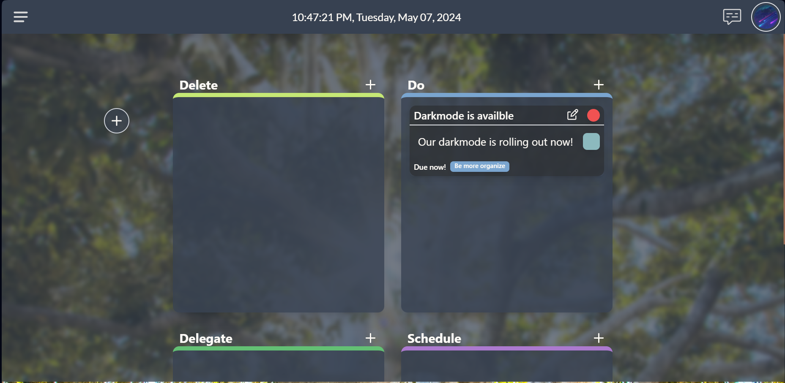
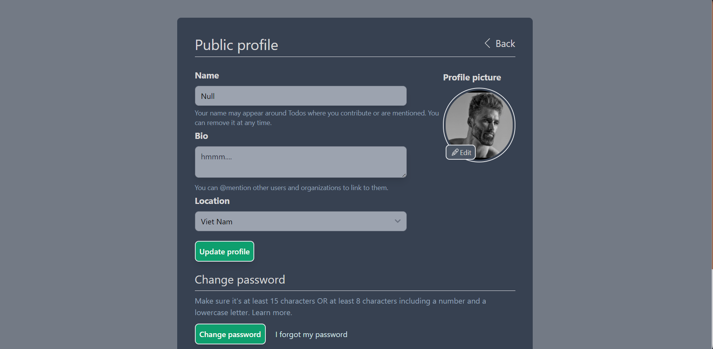

# ToDo-List
**Web Application about Productivity Tracker - aka. ToDo List, integrate AI and tree game**

[Demo Link: https://to-do-list.live](https://to-do-list.live)

## Features

### Todo List Management
- **Create-Read-Update-Delete (CRUD) Functionality**: Manage personal and team todo lists with ease.
- **Eisenhower Matrix**: Prioritize tasks based on urgency and importance for more effective task management.
- **Calendar Integration**: Visualize tasks on a calendar similar to Google Calendar for better time management.

### AI Integration
- **Automatic Recommendations**: Leverage AI to generate intelligent recommendations such as creating new todos, continuing existing tasks, and managing your todo list effectively.

### Todo Tree Minigame
- **Growth Mechanism**: Your tree will grow as you complete tasks and missions, providing a fun and rewarding way to track your productivity.
- ~~**Withering Mechanism**~~: The feature to wither the tree due to expired tasks/missions has been removed to maintain a positive and encouraging environment.

### Future Enhancements
- ~~**Notifications and Encouragements**~~: AI-driven notifications and motivational messages to keep you on track and inspired (planned for future releases).

## Technologies:
- Frontend: HTML, TailwindCSS, jQuery + JavaScript
- Backend: Python Flask
- Database: MySQL
- Host: DigitalOcean

## Collaborators:
- Leader: JakeClark38a (Nguyễn Chí Thành - 22521350) (another account: JakeClark-chan)
- Sub-Leader: Witnull (Trần Nguyễn Tiến Thành - 22521364)
- SeaWind (Nguyễn Hải Phong - 22521088)
- KienSD (Hồ Trung Kiên - 22520704)
- lightunderwolft (Hồ Vĩnh Nhật - 22521013)

# Setup Website - Details

## Prerequisites

Before you begin, ensure you have the following installed on your machine:

- Python 3.x
- MySQL Server
- pip (Python package installer)
- Node.js and npm (for Tailwind CSS)
- virtualenv (optional but recommended for managing project dependencies)

## Step-by-Step Instructions

### 1. Clone the Repository

First, clone the repository to your local machine:

```sh
git clone https://github.com/DataDefendersWithAI/ToDo-List-Backup
cd ToDo-List-Backup
```

### 2. Create and Activate a Virtual Environment (optional but recommended)

Create a virtual environment to manage your project's dependencies:

```sh
python -m venv venv
source venv/bin/activate  # On Windows use `venv\Scripts\activate`
```

### 3. Install Python Dependencies

Install the required Python packages listed in the `requirements.txt` file:

```sh
pip install -r requirements.txt
```

### 4. Install and Configure MySQL

Follow the instructions in [MYSQL_TUTORIAL.md](MYSQL_TUTORIAL.md) to install MySQL on your system.

### 5. Setup Flask-Migrate

Initialize Flask-Migrate to manage your database migrations:

#### 5.1 Initialize Migrate

Inside your Flask application directory, initialize Flask-Migrate:

```sh
flask db init
```

#### 5.2 Create an Initial Migration

Generate an initial migration script:

```sh
flask db migrate -m "Initial migration."
```

#### 5.3 Apply the Migration

Apply the migration to your database:

```sh
flask db upgrade
```

### 6. Install and Configure Tailwind CSS

#### 6.1 Install Node.js and npm

If you don't have Node.js and npm installed, you can install them from the [official Node.js website](https://nodejs.org/).

#### 6.2 Install Tailwind CSS

Navigate to your project directory and install Tailwind CSS via npm:

```sh
npm install -D tailwindcss flowbite
```

#### 6.3 Run Tailwind CSS

```sh
npm run build
```

### 7. Run the Web Application

Use Gunicorn to run your Flask application. Gunicorn is a Python WSGI HTTP Server for UNIX that serves your application:

```sh
gunicorn -b 127.0.0.1:5000 app:app
```

## Feature Map


**All below images update until night 08/05/2024**

## *Feature Map - Progress*


**All below images update until night 07/05/2024**

### *Few screenshot (desktop)*
**Main page**

**Calendar**

**Team**

**Tree**

**Light mode**

**Chadbot**

**Profile page**

**Landing page**


### *Few screenshot (mobile)*
...             |  ...
:-------------------------:|:-------------------------:
**Main page**   |  **Calendar** 
**Team**  | **Tree** 
**Light mode**  | **Chadbot** 
**Profile page** | **Landing page** 

[Timeline (Vietnamese - No implementation date - No update till now)](https://docs.google.com/spreadsheets/d/1MAMZZLN4X1kk-8I4zG77Cs-AGEdnr1_v/edit?usp=sharing&ouid=117486916258965576138&rtpof=true&sd=true)
